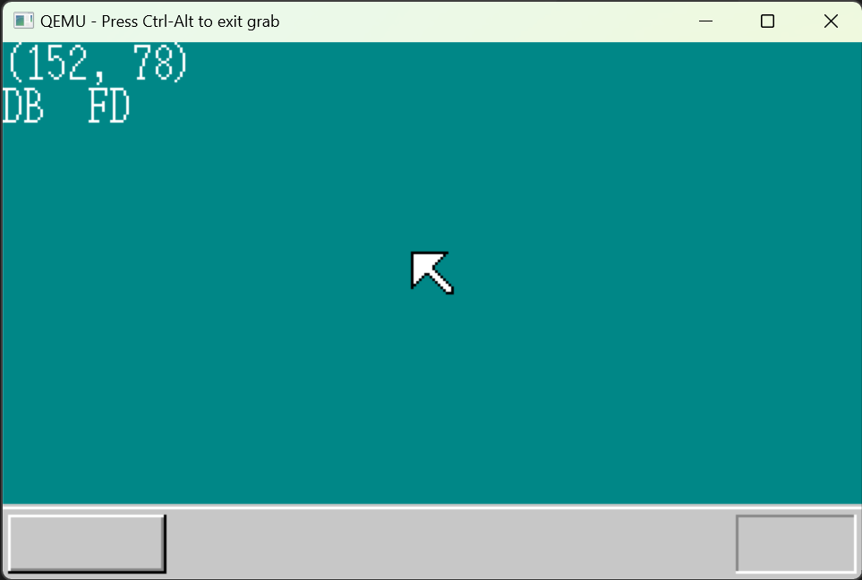
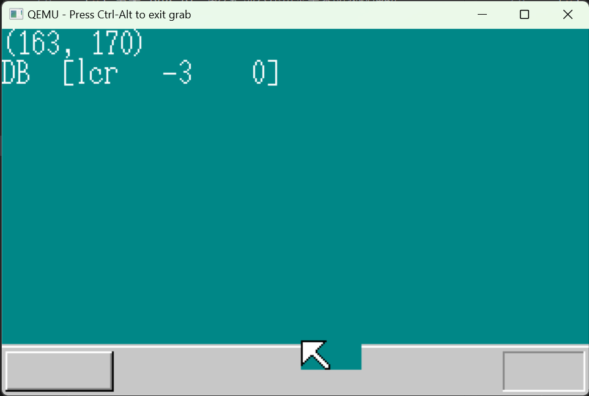
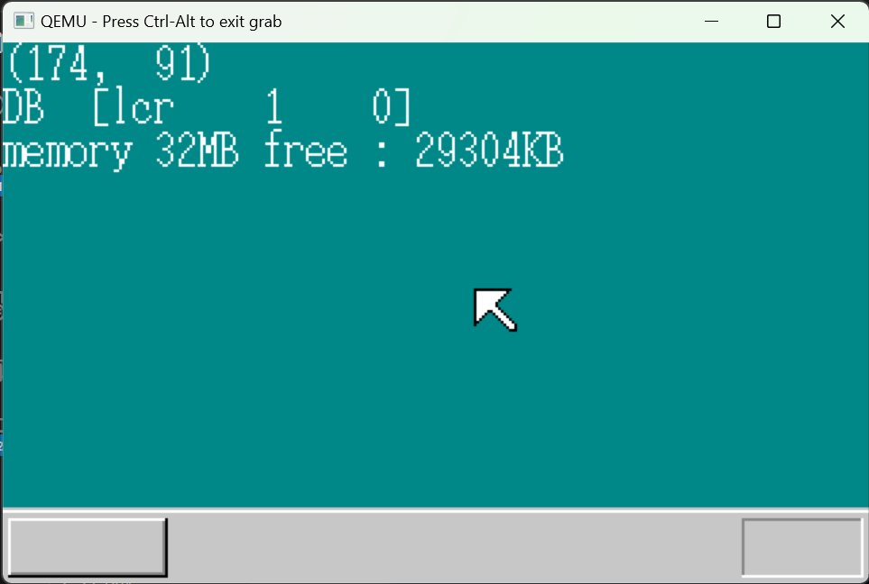
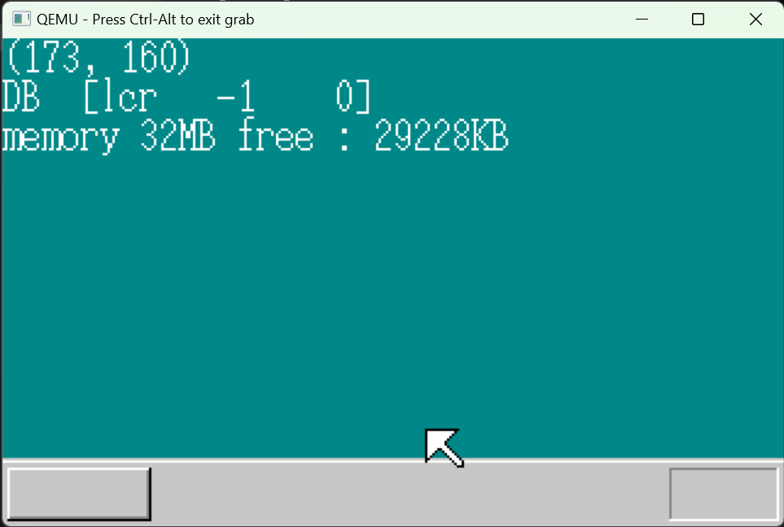

# XYZ OS🐧

本仓库负责存储郑州轻工业大学计算机学院操作系统课程设计代码

🥳 本项目将依托《30 天自制操作系统》从零开始制作一个操作系统 🎉

本文档**实验详情**部分尚未完成！！**实现的新功能**部分已完成！！！

运行方式：

以下为 Powershell 使用 CMD 时自行替换斜杠

```powershell
cd ./src/25_day
./make.bat run
```

日志：日志为初次读书的感受，很多疑惑在反复读书后均已解决

| 书本章节 | 进度      | 备注                                                         | emoji |
| -------- | --------- | ------------------------------------------------------------ | ----- |
| day1     | 2023-5-28 | 可以调用显卡 BIOS 中断显示字符                               | 🎊     |
| day2     | 2023-5-28 | 前 512 字节的磁盘文件生成和完整镜像生成，makefile 文件完善   | 💾     |
| day3     | 2023-5-29 | C 语言导入，从磁盘读入 10 个柱面                             | 🥲     |
| day4     | 2023-5-29 | 已经可以基本显示画面了，逐渐感觉到有意思了                   | 🥳     |
| day5     | 2023-5-31 | 了解了结构体的内存分布和使用，新增的 GDT 和 IDT 部分很迷糊   | 😫     |
| day6     | 2023-5-31 | PIC 也很迷糊，中断处理程序作用是保护 CPU 现场，结合 day5 可以理解一点 | 🤨     |
| day7     | 2023-6-1  | 理解了 FIFO 先进先出的实现，将其应用在处理键盘和鼠标的中断处理中 | 🥱     |
| day8     | 2023-6-1  | 解析鼠标传入的信号，获得点击和移动事件，修改图形显示代码，实现鼠标的移动 | 🤩     |
| day9     | 2023-6-2  | 使用试探的方式探测内存大小，碰到了编译器过优化的问题，使用汇编重写函数解决 | 🫡     |
| day10    | 2023-6-2  | 这一天的算法有些难理解，不过不怎么涉及操作系统，大多为图形学算法 | 📊     |
| day11    | 2023-6-2  | 这一天使用了大量的优化算法，优化图形性能，第一次看一头雾水，多看几遍才勉强理解 | 😫     |
| day12    | 2023-6-3  | 使用了外部设备发生中断的方式定时，后面的优化算法，看的也是一头雾水 | ⏱️     |
| day13    | 2023-6-3  | 最最最最懵逼的一天，逐行读有些读不下去，为了推进度只好先弄懂是做什么的 | 💩     |
| day14    | 2023-6-3  | 内容较为简单，先判断显卡支不支持高分，支持后才切换高分       | 😋     |
| day15    | 2023-6-4  | 使用了 TSS 段和 GDT 内存分段功能实现了多任务，时间片轮转     | 👻     |
| day16    | 2023-6-4  | 将代码整合成 api 的形式，加入优先级功能                      | ✈️     |
| day17    | 2023-6-4  | 整体难度不大，利用前面搭建好的各种函数，即可绘制出控制台     | 💻     |
| day18    | 2023-6-5  | 对控制台窗口功能进行升级，难度不大，然后读取 FAT12 文件系统的信息描述块，拿到文件信息 | 💾     |
| day19    | 2023-6-5  | 主要为难在 FAT 表，我混淆了 FAT 表和文件信息描述块，详情查看实验详情第 19 天 | 📄     |
| day20    | 2023-6-6  | 使用汇编编写 api 函数，注册软中断，使用 EDX 寄存器保存功能，在 GDT 中注册了，中断处理函数 | 👻     |
| day21    | 2023-6-6  | 一头雾水，完全没看懂，但是感觉和推进进度无关，先放一放       | 💩     |
| day22    | 2023-6-7  | 使用 C 语言编写可执行文件，通过调用系统 API 的形式工作       | 🥳     |
| day23    | 2023-6-7  | 新加入几个图形 API，丰富系统功能                             | 🌏     |
| day24    | 2023-6-7  | 时间有些紧，没仔细看，但是觉得不影响进度                     | 💩     |
| day25    | 2023-6-7  | 时间有些紧，没仔细看，但是觉得不影响进度                     | 💩     |
| 新功能   | 2023-6-8  | 仿照系统提供的可执行程序的写法和 API 调用的写法，自己创建了几个 API，实现一些新功能 | 🥳     |

## 项目结构

```
- src             # 项目代码
  - 01_day
  - 02_day
  - 03_day
  ...
- README.md       # 总介绍文件

- index.html      # web entry   不用关心
- docs            # web code    不用关心
- clang-format    # C语言格式化工具配置文件 规范代码
- .gitignore      # Git忽略文件
- image_md        # 图片存储
```

## 疑问

- [x] 书本 P80-84 调色板部分代码尚未查阅资料理解

  [《30 天自制操作系统》学习笔记——第四天\_调色板的访问模式\_cer_ml 的博客-CSDN 博客](https://blog.csdn.net/applenob/article/details/19134911)

  以及为什么调色版中 RGB 除以 4：

  > 在这段代码中，通过向 VGA 显示器的 0x03c9 端口写入 RGB 颜色来设置调色板。由于 VGA 显示器使用 6 位（2^6=64）来表示每个颜色通道的亮度值，因此将每个颜色通道的值除以 4 可以将 8 位（2^8=256）的颜色范围缩小到 6 位的颜色范围内，并且保留了更高的灰阶级别。

- [x] 书本 P100 鼠标背景显示函数的实际意义？

  > 最开始我以为这个函数可以解决覆盖原背景色的问题，实际上不是的，这个函数就是绘制一个16*16的色块，解决背景色覆盖问题在day10叠加处理处解决

- [x] 书本 P113 LGDT 的计算没看懂

  > ESP 寄存器 第四位开始存储 0000ffff 第六位存储 00270000 从第 4 位开始计算
  >
  > FF FF 00 00 00 27 00 00
  >
  > 4 5 6 7 8 9 10 11
  >
  > 而 GDTR48 位寄存器 也就是 6 字节 低 16 位是段上限 其余 32 位是开始地址 即最初两个字节是段上限其余四个字节是开始地址
  >
  > 需要的结果为 FF FF 00 27 00 00
  >
  > \_load_gdtr:
  >
  > MOV AX,[ESP+4]
  >
  > MOV [ESP+6],AX
  >
  > LGDT [ESP+6]
  >
  > RET
  >
  > 以上代码 AX 中先存放 FF FF
  >
  > 然后将 FF FF 放入 ESP+6 此时 ESP 为
  >
  > FF FF FF FF 00 27 00 00
  >
  > 4 5 6 7 8 9 10 11
  >
  > 此时在读取 ESP+6 就是 FF FF 00 27 00 00

- [x] 代码 day6 25 26 行没看懂

  > 在 PIC 上打开键盘和鼠标的中断

- [x] 代码 汇编 OUT 和 IN 是怎么工作的

  > 向设备端口写入和读取 查表才可以

- [x] 书本 day5-6 还是由很多疑问 GDT IDT PIC 等

  > 我理解 PIC 为可编程中断控制，在 IDT 中注册中断的处理函数，在 PIC 中开启中断，才可以接收到中断
  >
  > 注册 IDT 的时候 传入的 2 就是 GDT 中注册过的第二段，第二段好像存储着当前 C 语言编译产物，2 _ 8 就是段地址，第二段，传入的函数就是偏移地址，即中断处理程序入口。2 _ 8 是因为段选择器第三位必须为 0，应该是权限，0 是最高权限
  >
  > IDT 的具体要求还不是很了解 以及为什么 C 语言编译产物在第二段内存中 二段的地址注册为 0x00280000 难道 C 语言产物运行也从 0x00280000 开始吗？
  >
  > 课本 P157 说了确实是这样 bootpack 开始 512 复制到了 0x00280000，所以 GDT 的第二段正好就是当前 C 语言产物的运行地址
  > #define LIMIT_GDT 0x0000ffff
  > #define ADR_BOTPAK 0x00280000
  > #define AR_DATA32_RW 0x4092
  > #define AR_CODE32_ER 0x409a
  >
  > set_segmdesc(gdt + 1, 0xffffffff, 0x00000000, AR_DATA32_RW); // 系统专用 可读写段 不可执行
  >
  > set_segmdesc(gdt + 2, LIMIT_BOTPAK, ADR_BOTPAK, AR_CODE32_ER); // 系统专用，可执行段，可读不可写
  >
  > 段 2 的作用就是存放 bootpack 的代码 bootpack 以 ORG 0 为前提翻译的
  >
  > 段 1 是 4G CPU 能管理的全部内存 具体作用还未知

- [x] 书本 P123 DS 也好 ES 也好 SS 也好 这句话没看懂

  > **chatgpt**的回答：还是一头雾水
  >
  > 在实模式下，CPU 使用段地址和偏移地址的方式来访问内存。当 CPU 执行指令时，会将段地址和偏移地址合并成一个物理地址，以访问内存中的数据。
  >
  > 在这段汇编代码中，将 SS、DS 和 ES 寄存器都设置为相同的值，主要是为了使它们都指向系统的数据段（data segment），从而能够在其中正确地访问变量和数据结构。
  >
  > 由于在实模式下，操作系统只能访问 1MB 的物理内存空间，因此将 SS、DS 和 ES 寄存器都设置为相同的值也可以最大化地利用可用的内存空间，从而提高程序的效率。
  >
  > 另外，在保护模式下，为了提高系统的安全性，SS、DS 和 ES 寄存器的值通常会分别指向不同的内存段，以避免程序意外地修改关键数据。

- [x] 书本 day8 的通往 32 位模式的跳转代码没看懂 但是不影响接下来的学习

- [x] 第十天的叠加处理，最后的优化算法没看懂 但是不影响接下来的学习

- [x] 第十一天消除闪烁 最后的优化算法没理解透彻 但是不影响接下来的学习

- [x] 第十二天的加快中断算法 没有看的很懂 已经全部看懂了

- [x] 第十三天的算法

  > harib10h 因为中断处理程序中存在数组的移位，这里换了类似链表的数据结构 避免了移位 加快了速度
  >
  > 具体算法没有深究，不影响看下去
  >
  > 哨兵完全没看懂

- [x] 第十六天算法 没看懂

  > 任务管理，没有逐句读代码

- [x] 多任务没看懂 第 17 天的代码 多任务切换的时候 应该不能多次执行 console_task 的吧，这里面包括了初始化

  > 是不是实际上多任务是记住了运行位置 然后接着运行位置？ 怎么实现的

- [x] cmdline 运行完一个程序后 如何清空的

- [x] 对 FAT 支持这里，为什么突然出现了压缩算法

  > FAT 是 FAT 文件系统中的一个表 用于记录文件的链接位置 之前看的那些是文件信息描述表 FAT 表和文件信息描述表不在一个位置

## 实现的新功能

#### 右下角时钟


经过查阅资料可得到获取 CMOS 信息的常量

编写如下代码拿到时间

```clike
// cmos.c
#include "bootpack.h"

unsigned char read_cmos(unsigned char p) {
    unsigned char data;
    io_out8(cmos_index, p);
    data = io_in8(cmos_data);
    io_out8(cmos_index, 0x80);
    return data;
}
unsigned int get_hour_hex() {
    return BCD_HEX(read_cmos(CMOS_CUR_HOUR));
}
unsigned int get_min_hex() {
    return BCD_HEX(read_cmos(CMOS_CUR_MIN));
}
unsigned int get_sec_hex() {
    return BCD_HEX(read_cmos(CMOS_CUR_SEC));
}
unsigned int get_day_of_month() {
    return BCD_HEX(read_cmos(CMOS_MON_DAY));
}
unsigned int get_day_of_week() {
    return BCD_HEX(read_cmos(CMOS_WEEK_DAY));
}
unsigned int get_mon_hex() {
    return BCD_HEX(read_cmos(CMOS_CUR_MON));
}
unsigned int get_year() {
    return (BCD_HEX(read_cmos(CMOS_CUR_CEN)) * 100) + BCD_HEX(read_cmos(CMOS_CUR_YEAR)) - 30 + 2010;
}
```

```clike
/**CMOS操作端口**/
#define cmos_index 0x70
#define cmos_data 0x71
/**CMOS中相关信息偏移*/
#define CMOS_CUR_SEC 0x0  // CMOS中当前秒值(BCD)
#define CMOS_ALA_SEC 0x1  // CMOS中报警秒值(BCD)
#define CMOS_CUR_MIN 0x2  // CMOS中当前分钟(BCD)
#define CMOS_ALA_MIN 0x3  // CMOS中报警分钟(BCD)
#define CMOS_CUR_HOUR 0x4 // CMOS中当前小时(BCD)
#define CMOS_ALA_HOUR 0x5 // CMOS中报警小时(BCD)
#define CMOS_WEEK_DAY 0x6 // CMOS中一周中当前天(BCD)
#define CMOS_MON_DAY 0x7  // CMOS中一月中当前日(BCD)
#define CMOS_CUR_MON 0x8  // CMOS中当前月份(BCD)
#define CMOS_CUR_YEAR 0x9 // CMOS中当前年份(BCD)
#define CMOS_DEV_TYPE 0x12// CMOS中驱动器格式
#define CMOS_CUR_CEN 0x32 // CMOS中当前世纪(BCD)

#define BCD_HEX(n) ((n >> 4) * 10) + (n & 0xf)// BCD转16进制

#define BCD_ASCII_first(n) (((n << 4) >> 4) + 0x30)// 取BC的个位并以字符输出,来自UdoOS
#define BCD_ASCII_S(n) ((n << 4) + 0x30)           // 取BCD的十位并以字符输出,来自UdoOS

unsigned int get_hour_hex();
unsigned int get_min_hex();
unsigned int get_sec_hex();
unsigned int get_day_of_month();
unsigned int get_day_of_week();
unsigned int get_mon_hex();
unsigned int get_year();
```

此代码运行在定时器中 刷新时间

```clike
// bootpack.c
sprintf(s, "%d-%02d-%02d %02d:%02d:%02d", get_year(), get_mon_hex(), get_day_of_month(), get_hour_hex(), get_min_hex(), get_sec_hex());

putfonts8_asc_sht(sht_back, binfo->scrnx - 160, binfo->scrny - 20, COL8_000000, COL8_C6C6C6, s, 19);

sheet_refresh(sht_back, binfo->scrnx - 160, binfo->scrny - 20,
              binfo->scrnx - 45 + 5 * 8, binfo->scrny - 50 + 16);
```

#### 读取时间的 API

注册 api 从 30 号开始编号 运行时触发软中断

```assembly
// a_nask.nas
_api_getsecond:		; int api_getsecond(void);
   		PUSH	EBX
		MOV		EDX,30
		INT		0x40
		POP		EBX
		RET

_api_getminute:		; int api_getminute(void);
		PUSH	EBX
		MOV		EDX,31
		INT		0x40
		POP		EBX
		RET

_api_gethour:		; int api_gethour(void);
		PUSH	EBX
		MOV		EDX,32
		INT		0x40
		POP		EBX
		RET

_api_getyear:		; int api_getyear(void);
		PUSH	EBX
		MOV		EDX,33
		INT		0x40
		POP		EBX
		RET

_api_getmonth:		; int api_getmonth(void);
		PUSH	EBX
		MOV		EDX,34
		INT		0x40
		POP		EBX
		RET

_api_getday:		; int api_getday(void);
		PUSH	EBX
		MOV		EDX,35
		INT		0x40
		POP		EBX
		RET
```

中断处理函数

```clike
// console.c
else if (edx == 30) {
        reg[7] = get_sec_hex();
    }
    else if (edx == 31) {
        reg[7] = get_min_hex();
    }
    else if (edx == 32) {
        reg[7] = get_hour_hex();
    }
    else if (edx == 33) {
        reg[7] = get_year();
    }
    else if (edx == 34) {
        reg[7] = get_mon_hex();
    }
    else if (edx == 35) {
        reg[7] = get_day_of_month();
}
```

#### 画圆 API

注册 edx 为 40 号的 api

```assembly
_api_drawcircle:	; void api_drawcircle(int win, int x, int y, int r, int nouse, int col);
		PUSH	EDI
		PUSH	ESI
		PUSH	EBP
		PUSH	EBX
		MOV		EDX,40
		MOV		EBX,[ESP+20]	; win
		MOV		EAX,[ESP+24]	; x
		MOV		ECX,[ESP+28]	; y
		MOV		ESI,[ESP+32]	; r
		MOV		EDI,[ESP+36]	; nouse
		MOV		EBP,[ESP+40]	; col
		INT		0x40
		POP		EBX
		POP		EBP
		POP		ESI
		POP		EDI
		RET
```

接受完参数后调用位于 graphic.c 的绘制图像函数

```clike
// console.c
else if (edx == 40) {
        sht = (struct SHEET *) (ebx & 0xfffffffe);
        int x = eax, y = ecx, r = esi;
        int color = ebp;
        drawcircle(sht->buf, x, y, r, color, sht->bxsize);
        if ((ebx & 1) == 0) {
            sheet_refresh(sht, x + r, y + r, x - r, y - r);
        }
}
```

使用计算机图形学中的 bresenham 算法绘制图像

```clike
// graphic.c
void drawFullCircle(int x0, int y0, int x, int y, int color, int xsize, char *vram) {
    int circle_x = x0;
    int circle_y = y0;
    vram[(circle_y + y) * xsize + (circle_x + x)] = color;
    vram[(circle_y + y) * xsize + (circle_x - x)] = color;
    vram[(circle_y - y) * xsize + (circle_x + x)] = color;
    vram[(circle_y - y) * xsize + (circle_x - x)] = color;
    vram[(circle_y + x) * xsize + (circle_x + y)] = color;
    vram[(circle_y + x) * xsize + (circle_x - y)] = color;
    vram[(circle_y - x) * xsize + (circle_x + y)] = color;
    vram[(circle_y - x) * xsize + (circle_x - y)] = color;
}
void drawcircle(char *vram, int x0, int y0, int r0, unsigned char c, int xsize) {
    int x = 0;
    int y = r0;
    int d = 1 - y;
    int color = c;
    while (x < y) {
        drawFullCircle(x0, y0, x, y, color, xsize, vram);
        if (d < 0) {
            d = d + 2 * x + 3;
        }
        else {
            d = d + 2 * (x - y) + 5;
            y = y - 1;
        }
        x = x + 1;
    }
}
```

效果：


#### 模拟时钟

结合以上工作

制作模拟时钟

使用画圆 API 绘制表盘 读取时间的 API 拿到时间 然后使用绘制直线的 API 绘制指针

绘制文字的 API 绘制时刻

```clike
#include <math.h>
#include <stdio.h>
int api_openwin(char *buf, int xsiz, int ysiz, int col_inv, char *title);
void api_initmalloc(void);
char *api_malloc(int size);
void api_refreshwin(int win, int x0, int y0, int x1, int y1);
void api_linewin(int win, int x0, int y0, int x1, int y1, int col);
void api_closewin(int win);
int api_getkey(int mode);
void api_end(void);
void api_putstrwin(int win, int x, int y, int col, int len, char *str);
int api_getsecond(void);
int api_getminute(void);
int api_gethour(void);
int ap_getyear(void);
int api_getmonth(void);
int api_getday(void);
void api_drawcircle(int win, int x, int y, int r, int nouse, int col);
int api_alloctimer(void);
void api_inittimer(int timer, int data);
void api_settimer(int timer, int time);
void api_boxfilwin(int win, int x0, int y0, int x1, int y1, int col);

double M_PI = 3.14;
HariMain(void) {
    char *buf;
    int win, i;
    api_initmalloc();
    buf = api_malloc(160 * 180);
    win = api_openwin(buf, 160, 180, -1, "CLOCK");
    static int label_m[60][2] = {
        // 内容太长 请直接阅读代码
    };
    static int label_h[12][2] = {
        // 内容太长 请直接阅读代码
    };
    static int label_text[12][2] = {
        // 内容太长 请直接阅读代码
    };
    int timer;
    timer = api_alloctimer();
    api_inittimer(timer, 128);
    char *s;
    int sec = 0, min = 0, hou = 0;

    sec = api_getsecond();
    min = api_getminute();
    hou = api_gethour();
    api_boxfilwin(win + 1, 80 - 65, 93 - 65, 80 + 65, 93 + 65, 8);
    // 圆心是80,93，半径是65 表盘
    api_drawcircle(win, 80, 93, 65, 0, 15);
    api_linewin(win + 1, 80, 93, label_m[min][0], label_m[min][1], 0);
    api_linewin(win + 1, 80, 93, label_h[hou % 12][0], label_h[hou % 12][1], 0);
    api_linewin(win + 1, 80, 93, label_m[sec][0], label_m[sec][1], 1);
    int dx = -5, dy = -6;
    for (;;) {
        // 清除原本
        api_boxfilwin(win + 1, 80 - 65, 93 - 65, 80 + 65, 93 + 65, 8);
        // 圆心是80,93，半径是65 表盘
        api_drawcircle(win, 80, 93, 65, 0, 15);
        int i;
        for (i = 0; i < 12; i++) {
            char s[2] = {0};
            int j = (i + 12) % 12;
            if (j == 0) j = 12;
            sprintf(s, "%d", j);
            api_putstrwin(win + 1, label_text[i][0] + dx, label_text[i][1] + dy, 0, 2, s);
        }
        api_linewin(win + 1, 80, 93, label_m[min][0], label_m[min][1], 0);
        api_linewin(win + 1, 80, 93, label_h[hou % 12][0], label_h[hou % 12][1], 0);
        api_linewin(win + 1, 80, 93, label_m[sec][0], label_m[sec][1], 1);

        api_refreshwin(win, 0, 0, 160, 180);

        api_settimer(timer, 100); /* 1秒 */
        if (api_getkey(1) != 128) {
            break;
        }
        sec = api_getsecond();
        min = api_getminute();
        hou = api_gethour();
    }
    api_closewin(win);
    api_end();
}

```

值得注意的是 程序中包含三个二维数组

这三个数组分别记录着

大刻度 12 0 1 2 3 4 5 6 7 8 9 10 11

小刻度 0-60

文字刻度 12 0 1 2 3 4 5 6 7 8 9 10 11

这些刻度的在窗口中的坐标 因为直接使用 math.h 计算会出现未知错误 这里我使用 python 计算好全部的刻度值 放入

三个数组中即可：

```python
# 用于计算钟表上各个刻度的坐标
import math
r = 55
for i in range(0, 12):
    # 60个刻度的坐标
    x = 80 + r * math.sin(math.pi / 180 * i * 30)
    y = 93 - r * math.cos(math.pi / 180 * i * 30)
    # 输出为 {x,y}, 的形式
    print("{%d,%d}," % (x, y))
```

最终实现模拟时钟


#### 开机动画

这里顽皮一下 其实就是为了加入而加入

修改了两部分

在读取完所有柱面后 输出 welcome 中的文字 然后执行 HLT 的循环到 0x8F 后跳入到启动程序


在 C 语言入口文件 wait_a_while 是汇编写的函数作用是执行 50 个 HLT

```clike
void HariMain(void) {
    struct BOOTINFO *binfo = (struct BOOTINFO *) ADR_BOOTINFO;
    bootcover(binfo, 0);
    wait_a_while();
    bootcover(binfo, 1);
    wait_a_while();
    bootcover(binfo, 2);
    wait_a_while();
    wait_a_while();
    bootcover(binfo, 3);
    wait_a_while();
    wait_a_while();
    wait_a_while();
    bootcover(binfo, 4);
    ....
}
```

bootcover.c 中简单的图形绘制

```clike
#include "bootpack.h"
void setColor(int x, int y, int color, int xsize, int ysize, char *vram) {
    if (x < 0 || x >= xsize || y < 0 || y >= ysize) {
        return;
    }
    char *p = vram + y * xsize + x;

    *p = color;
}
void bootcover(struct BOOTINFO *binfo, int step) {
    int xsize = binfo->scrnx, ysize = binfo->scrny;
    int i, j;
    int color = 15;
    if (step == 0) {
        for (i = 0; i < xsize; i++) {
            for (j = 0; j < ysize; j++) {
                setColor(i, j, color, xsize, ysize, binfo->vram);
            }
        }
    }
    // 绘制矩形
    int width, height = 40;
    int x = 0, y = binfo->scrny / 2 - height / 2;
    if (step == 0) {
        width = binfo->scrnx / 4 * 1;
    }
    else if (step == 1) {
        width = binfo->scrnx / 4 * 2;
    }
    else if (step == 2) {
        width = binfo->scrnx / 4 * 3;
    }
    else if (step == 3) {
        width = binfo->scrnx - 1;
    }
    else {
        color = 0;
        for (i = 0; i < xsize; i++) {
            for (j = 0; j < ysize; j++) {
                setColor(i, j, color, xsize, ysize, binfo->vram);
            }
        }
        return;
    }
    for (i = 0; i < width; i++) {
        for (j = 0; j < height; j++) {
            setColor(x + i, y + j, 1, xsize, ysize, binfo->vram);
        }
    }
    return;
}
```

效果


#### 关机 重启

以下代码是从网上收集来的，不是很理解

```assembly
; [BITS32]
_shutdown:
JMP start2
db 0x00, 0x00
protect16:
db 0xb8, 0x08, 0x00, 0x8e, 0xd8, 0x8e, 0xc0, 0x8e, 0xd0
db 0x0f, 0x20, 0xc0, 0x66, 0x25, 0xfe,0xff,0xff, 0x7f
db 0x0f, 0x22, 0xc0
db 0xea
dw 0x0650,0x0000
ALIGNB 16
protect16_len EQU $ - protect16
;上面的代码为16位保护模式跳入实模式功能代码
;保护模式代码传送到内存0x0630处，为它保留0x20 B

realmod:
db 0x8c, 0xc8
db 0x8e, 0xd8
db 0x8e, 0xc0
db 0x8e, 0xd0
db 0xbc, 0x00, 0x08
db 0xe4, 0x92
db 0x24, 0xfd
db 0xe6, 0x92
db 0x90, 0x90, 0x90
db 0xfb, 0x90
db 0xb8, 0x03, 0x00
db 0xcd, 0x10
;db 0xf4 ;关机
db 0xb8, 0x07, 0x53
db 0xbb, 0x01, 0x00
db 0xb9, 0x03, 0x00
db 0xcd, 0x15
ALIGNB 16
realmod_len EQU $ - realmod
; 以上代码段为实模式下设置字符显示模式及关机代码
; 实模式功能代码传送到0x0650处。

GDTIDT:
dw 0x0000, 0x0000, 0x0000, 0x0000
dw 0xffff, 0x0000, 0x9200, 0x0000
dw 0xffff, 0x0000, 0x9800, 0x0000
dw 0x0000
dw 0x0017
dw 0x0600, 0x0000
dw 0x03ff
dw 0x0000, 0x0000
ALIGNB 16
GDTIDT_lenth EQU $ - GDTIDT
;以上为GDT及ITD表项数据
;以上数据传送到0x0600处，保留0x30 B的空间。

start2:
MOV EBX, GDTIDT
MOV EDX, 0x600
MOV CX, GDTIDT_lenth
.loop1:
MOV AL, [CS:EBX]
MOV [EDX], AL
INC EBX
INC EDX
loop .loop1

MOV EBX, protect16
MOV EDX, 0x630
MOV CX, protect16_len
.loop2:
MOV AL, [CS:EBX]
MOV [EDX], AL
INC EBX
INC EDX
loop .loop2

MOV EBX, realmod
MOV EDX, 0x650
MOV CX, realmod_len
.loop3:
MOV AL, [CS:EBX]
MOV [EDX], AL
INC EBX
INC EDX
loop .loop3

LGDT [0x061A]
LIDT [0x0620]
JMP 2*8:0x0630

_reboot:
mov al,0feh
out 64h,al
```

效果：

#### 使用 Python 编写制作鼠标指针的程序

此功能为额外功能

使用 opencv 处理图片 图片转为灰度图 然后根据设置的阈值转为二值图 然后转为字符串形式

```python
import cv2 as cv

# 打开图片
img = cv.imread("mouse.png")
# 图片缩放16*16
img = cv.resize(img, (16, 16))
gray = cv.cvtColor(img, cv.COLOR_BGR2GRAY)
ret, binary = cv.threshold(gray, 150, 255, cv.THRESH_BINARY)
# 保存为16*16字符串 亮色用 . 表示，暗色用 O 表示
for i in range(16):
    print("\"", end="")
    for j in range(16):
        if binary[i, j] == 255:
            print(".", end="")
        else:
            print("O", end="")
    print("\",")

```

传入图片：


得到效果：


运行效果：


#### 调节鼠标速度的程序

在鼠标移动时 给位移参数乘上缩放比例

修改头文件中的 MOUSE_DEC 加入 scale

```clike
struct MOUSE_DEC {
    unsigned char buf[3], phase;
    int x, y, btn;
    int scale;
};
```

主函数中乘系数 第五行的函数用于显示字体但是使用 rgb 背景色 详情看 主题更换 节

```clike
mx += mdec.x * mdec.scale;
my += mdec.y * mdec.scale;
char *text;
sprintf(text, "Press the middle key to increase mouse speed:%d", mdec.scale);
putfonts8_asc_sht_rgbbk(sht_back, 0, 200, COL8_FFFFFF, text, 60, 51, 65, 85);
```

鼠标处理部分 按下中键修改速度

```clike
// 按下中键
if ((mdec.btn & 0x04) != 0) {
    if (mdec.scale == 10) {
        mdec.scale = 1;
    }
    else {
        mdec.scale += 1;
    }
}
```

效果


#### 中文支持

使用[点阵字符在线生成，点阵字代码生成器 (qqxiuzi.cn)](https://www.qqxiuzi.cn/zh/dianzhenzi-zifu/)

生成点阵 修改格式后存入 font_x 数组中 使用 putfont16 绘制


```clike
// graphic.c
void putfont16(char *vram, int xsize, int x, int y, char c, char font[16][16]) {
    // 传入font是16*16的数组
    int i, j;
    char *p, d /* data */;
    for (i = 0; i < 16; i++) {
        for (j = 0; j < 16; j++) {
            p = vram + (y + i) * xsize + x + j;
            d = font[i][j];
            if (d == '1') {
                p[0] = c;
            }
        }
    }
    return;
}

static char font_1[16][16] = {
    "0000000000000000",
    "0100001100000000",
    "0110011001111110",
    "0011010001111110",
    "1111111101100110",
    "1111111101100110",
    "0001100001101100",
    "0001100001101000",
    "1111111101101100",
    "1111111101100110",
    "0001100001100110",
    "0001110001100110",
    "0011011001111110",
    "0110001101101100",
    "1100000101100000",
    "1000000001100000",
};
```

#### 主题更换

创建使用 RGB 做色彩的相关函数

```clike
unsigned char rgb2pal(int r, int g, int b, int x, int y) {
    static int table[4] = {3, 1, 0, 2};
    int i;
    x &= 1; /*判断是偶数还是奇数*/
    y &= 1;
    i = table[x + y * 2]; /*用来生成中间色的常量*/
    r = (r * 21) / 256;   /* r为0～20*/
    g = (g * 21) / 256;
    b = (b * 21) / 256;
    r = (r + i) / 4; /* r为0～5*/
    g = (g + i) / 4;
    b = (b + i) / 4;
    return 16 + r + g * 6 + b * 36;
}


void boxfillrgb(unsigned char *vram, int xsize, int x0, int y0, int x1, int y1, int r, int g, int b) {
    int x, y;
    for (y = y0; y <= y1; y++) {
        for (x = x0; x <= x1; x++) { vram[y * xsize + x] = rgb2pal(r, g, b, x, y); }
    }
    return;
}
void putfonts8_asc_sht_rgbbk(struct SHEET *sht, int x, int y, int c, char *s, int l, int r, int g, int b) {
    boxfillrgb(sht->buf, sht->bxsize, x, y, x + l * 8 - 1, y + 15, r, g, b);
    putfonts8_asc(sht->buf, sht->bxsize, x, y, c, s);
    sheet_refresh(sht, x, y, x + l * 8, y + 16);
    return;
}
```

效果，背景色为(51, 65, 85)


## 实验详情

运行原理：每一天的运行原理都相似，都是通过make指令运行z_tools/qemu文件夹，此文件夹下有Makefile，其中包含了一个批处理命令可以启动qemu.exe，这个批处理中包含了qemu的启动参数等。

### 第一天

第一天最开始使用二进制编辑器直接制作磁盘镜像文件。后来改为使用作者自己开发的汇编工具nask制作磁盘镜像，但是使用的汇编指令多为DB和RESB为主，暂时还无法直接读懂。

第一天的最后一部分使用汇编指令编写程序，至此为止可以读懂一部分。

值得注意的是最后的RESB 0x1fe-$是为了补满510个字节。而启动扇区总共512字节，为什么补510字节，因为启动扇区要求最后两个字节是55 AA 所以留了两个字节。

因为只有部分指令是可读懂的汇编，是字符输出部分，修改这部分之后即可得到下图结果，0x0a在ascii码中是换行符的意思，在C语言中的表示就是熟悉的\n，所以这里多添加了几个换行符，并将字符修改为hello,XYZ!!!


### 第二天

第二天引入了Makefile，用于工程化管理项目，汇编文件也全部使用可读懂的形式编写，这其中用到了INT 0x10中断，查阅资料可知这是调用显卡BIOS的指令，AH和BX中存入了参数，AL存入字符，当前模式是打字机模式。

整个汇编的大意为循环msg标识符的内容，如果值不为0(msg的末尾是0)则依次将字符压入AL中，然后调用显卡中断输出AL，以此实现将msg标识符的内容依次输出到屏幕。由于用的都是x86指令，所以可以运行在vmware虚拟机和裸机。

后来又引入了磁盘制作工具，将启动分区的数据和其他的数据隔开，启动分区单独形成ipl.nas文件。


附上 VMware 的运行结果和裸机运行结果


### 第三天

第三天在原有的启动分区基础上，加入了读磁盘的指令，使用INT 0x13中断，将磁盘内容读入到内存中。

使用循环的方式，依次修改INT 0x13的参数。

按顺序读入18个扇区\*正反两磁头\*10个柱头 = 360个扇区 一个扇区512字节 总计180KB的内容

至此为启动分区编写完毕。

开始编写操作系统的文件，建立一个汇编文件，写入HLT简单的指令后将汇编文件编译为.sys文件，将sys文件放入磁盘镜像中，使用二进制编辑器找到这个文件在磁盘镜像中真正的位置发现文件内容位于0x004200之后，为什么是这个位置，读到后面才知道这是FAT12文件系统的特征。

位于磁盘0x4200的内容，磁盘第二个扇区被装载到0x8200处。即可假想为第一个扇区在0x8000处(实际上应该在0x7200处)。

但是可以认为磁盘在内存上是从0x8000开始的，0x8000+0x4200等于0xc200号地址，即sys文件的开始在0xc200

修改启动分区的最后，加上JMP 0xc200，这样即可实现从启动分区跳转到sys文件，而sys文件由汇编编译来，所以该汇编文件即可视作操作系统，可以从这里开始操作系统开发。

在汇编文件中写入显卡中断，参数调整为320x200x8位彩色。运行后发现屏幕呈黑色，即可说明显卡成功驱动。以上部分工作全部成功。

接着在汇编文件中，将一些系统信息保存到指定内存处。

接着在汇编文件中引入一系列暂时看不懂的指令，使系统进入32位。

引入C语言处比较复杂，通过一系列工具链将C语言和上述汇编文件链接起来形成haribote.sys可看作最终的操作系统，可以实现汇编和操作系统的混合开发。接着在汇编文件处编写名为_io_hlt的函数，经过编译器编译后，可以被C语言识别为io_hlt函数。

在C语言处调用io_hlt即可实现CPU休眠。


### 第四天

通过往显存中写值实现绘制图。这里新增了write_mem8函数，也是混合编程，像指定地址写入指定值，不过该函数后期会被指针替换。

书本中使用循环往0xa0000和0xaffff处写值实现全屏色彩的更改。

值得注意的是这里的范围其实超出了实际情况。因为320\*200\*8的屏幕，显存仅需要320*200 = 0xFA00 这么大的空间，即0xa0000到0xafa00。如果修改范围为0xa0000-0xafa00，屏幕照样全屏幕都可以显示，如果将此范围修改小一点点，可以看到屏幕右下角有很小的缺块。这里使用更大的范围，可能是因为后期提升分辨率后，适应更大的分辨率。

接下来引入调色板模式，自定义每个色号对应的颜色。具体规则，初次读书没有读懂，放在了“疑问“中，相应解答也在“疑问”中。

我这里两个实验结果 使用 makefile 的变量切换编译的文件

一个是结合了计算机图形学的简单算法绘制图像 直接读写显存

一个是书本的运行结果

对于这个结果我也做了相应注释

绘制多个色块，实现类似于浮雕的效果

```C
/* 根据 0xa0000 + x + y * 320 计算坐标 8*/
// 屏幕上方的蓝绿色 也就是 类似桌面壁纸的东西
boxfill8(vram, xsize, COL8_008484, 0, 0, xsize - 1, ysize - 29);
// 任务栏的上边界的颜色 用于显示出浮雕的效果
boxfill8(vram, xsize, COL8_C6C6C6, 0, ysize - 28, xsize - 1, ysize - 28);
// 任务栏的上边界的颜色 用于显示出浮雕的效果
boxfill8(vram, xsize, COL8_FFFFFF, 0, ysize - 27, xsize - 1, ysize - 27);
// 任务栏色彩填充
boxfill8(vram, xsize, COL8_C6C6C6, 0, ysize - 26, xsize - 1, ysize - 1);

// 任务栏左边色块 上边界
boxfill8(vram, xsize, COL8_FFFFFF, 3, ysize - 24, 59, ysize - 24);
// 任务栏左边色块 左边界
boxfill8(vram, xsize, COL8_FFFFFF, 2, ysize - 24, 2, ysize - 4);
// 任务栏左边色块 下边界
boxfill8(vram, xsize, COL8_848484, 3, ysize - 4, 59, ysize - 4);
// 任务栏左边色块 右边界
boxfill8(vram, xsize, COL8_848484, 59, ysize - 23, 59, ysize - 5);
// 任务栏左边色块 下边界黑色条
boxfill8(vram, xsize, COL8_000000, 2, ysize - 3, 59, ysize - 3);
// 任务栏左边色块 右边界黑色条
boxfill8(vram, xsize, COL8_000000, 60, ysize - 24, 60, ysize - 3);

// 右边方块 上边界
boxfill8(vram, xsize, COL8_848484, xsize - 47, ysize - 24, xsize - 4, ysize - 24);
// 右边方块 左边界
boxfill8(vram, xsize, COL8_848484, xsize - 47, ysize - 23, xsize - 47, ysize - 4);
// 右边方块 下边界
boxfill8(vram, xsize, COL8_FFFFFF, xsize - 47, ysize - 3, xsize - 4, ysize - 3);
// 右边方块 右边界
boxfill8(vram, xsize, COL8_FFFFFF, xsize - 3, ysize - 24, xsize - 3, ysize - 3);
```


### 第五天

结构体在内存中顺序存储，结构体指针指向结构体的首地址，结构体各个元素都可以按顺序用箭头访问到

然后使用了字符点阵的形式表示单个字符，这里对以下输出算法做个简单的例子

```clike
int main(){
    static char font_A[16] = {
		0x00, 0x18, 0x18, 0x18, 0x18, 0x24, 0x24, 0x24,
		0x24, 0x7e, 0x42, 0x42, 0x42, 0xe7, 0x00, 0x00
	};

	putfont8(binfo->vram, binfo->scrnx, 10, 10, COL8_FFFFFF, font_A);
}
void putfont8(char *vram, int xsize, int x, int y, char c, char *font)
{
	int i;
	char *p, d /* data */;
	for (i = 0; i < 16; i++) {
		p = vram + (y + i) * xsize + x;
		d = font[i];
		if ((d & 0x80) != 0) { p[0] = c; }
		if ((d & 0x40) != 0) { p[1] = c; }
		if ((d & 0x20) != 0) { p[2] = c; }
		if ((d & 0x10) != 0) { p[3] = c; }
		if ((d & 0x08) != 0) { p[4] = c; }
		if ((d & 0x04) != 0) { p[5] = c; }
		if ((d & 0x02) != 0) { p[6] = c; }
		if ((d & 0x01) != 0) { p[7] = c; }
	}
	return;
}
```

以上 font_A 存储了 A 字符的点阵信息


```
// 对以上代码进行分析
// 13行的for就是循环点阵每一行 16-23的判断就是输出每一行中的每一列
// 以第三行 00011000为例 此时d为0x18 也就是00011000
16行
00011000
10000000
-------- &
00000000
不显示字符

19行
00011000
00010000
-------- &
00010000
显示字符

由此可知
使用按位递减的与操作，可以判断出d的每一位是不是1 从而决定该像素是否被渲染
```

这里将 A 的字符点阵进行修改 倒数第三行全部换成 1

新的 font_A

```clike
static char font_A[16] = {
	0x00, 0x18, 0x18, 0x18, 0x18, 0x24, 0x24, 0x24,
	0x24, 0x7e, 0x42, 0x42, 0x42, 0xff, 0x00, 0x00
};
```


后引入的hankaku.txt可以通过相应处理工具处理为数组的形式，可以使用他提供的ASCII字库

在第五天我们还研究出如何更改入口函数

是很蹩脚的方法，仅在这里做简单说明，没有找到更好的办法前，还是使用默认的入口函数

在 naskfunc.nas 添加以下语句，声明原本的入口函数后 调用自己的入口函数名称 根据汇编规则前面加\_

为了防止报错 还要 EXTERN 这个标识符 也要把 HariMain 暴漏出去

实现了以下效果


后又引入鼠标绘制函数以及GDT和IDT的初始化。

在汇编保护模式下，访问内存时，也要采用段地址和偏移地址的形式，但是段地址不能直接访问内存，要使用段号，这里的段号就是GDT中注册的段号。

GDT的具体参数配置比较复杂，主要用于向下兼容。他们的参数都由处理器规定好了。

IDT是中断信息描述表，注册后可以自己注册自己的中断号码以及处理函数，注意处理函数的定位要采用GDT注册的段号。

GDT表放入内存，首地址存入GDTR寄存器中，IDT首地址存入IDTR寄存器中。

这两部分内容具体参数较为复杂，这里给出参考资料。

https://blog.csdn.net/chungle2011/article/details/80069703?ydreferer=aHR0cHM6Ly93d3cuZ29vZ2xlLmNvbS8%3D

https://blog.csdn.net/abc123lzf/article/details/109289567

https://www.cnblogs.com/boyxiao/archive/2010/11/20/1882716.html

https://blog.csdn.net/qq_22642239/article/details/70140859

https://www.jianshu.com/p/55f805c8c379

https://zhuanlan.zhihu.com/p/105939886

### 第六天

第六天主要做了文件分割

将 C 语言分割为多个带源文件和头文件的文件

然后做了 PIC 的初始化可以接收硬件来的中断信号

关于load_gdtr的函数的计算方法，我在”疑问“处做了讲解

然后使用栈的数据结构做了 CPU 现场保护

即需要调用中断处理程序前，需要保存 CPU 当前寄存器的所有值

调用后恢复所有值 CPU 回到正常运行

然后再IDT表中注册鼠标和键盘中断处理函数。

注册时，传入的函数相当于处理函数在当前段中的偏移地址(因为编译系统的时候，默认以段号0开始编译，所以函数地址就是偏移地址)，段地址就是2号，这在GDT初始化的时候，就将2号段注册为了操作系统文件运行的内存段。乘8是因为段选择子第三位有别的用处，用于权限控制。


### 第七天

中断处理函数中 0x60+IRQ 号输出给 OCW2 重启中断检测

```clike
void inthandler21(int *esp)
{
	unsigned char data;
	io_out8(PIC0_OCW2, 0x61); // 键盘是IRQ1 鼠标是IRQ12
	data = io_in8(PORT_KEYDAT);
	fifo8_put(&keyfifo, data);
	return;
}

struct FIFO8 mousefifo;

void inthandler2c(int *esp)
{
	unsigned char data;
	io_out8(PIC1_OCW2, 0x64);	// IRQ12位于从PIC的第四个地址
	io_out8(PIC0_OCW2, 0x62);	// 通知PIC0 IRQ2的受理完成
	data = io_in8(PORT_KEYDAT);
	fifo8_put(&mousefifo, data);
	return;
}
```

然后使用数组的方式，建立了一个先入先出的数据结构，使用双指针指向数组头和尾，形成循环存储。该数据结构全书都将用到。

将键盘接受的值存入缓冲区，然后在主函数中，判断缓冲区是否为空，不为空输出键盘信号。

然后向硬件端口发送信号，启动鼠标和键盘电路。

由于注册好了鼠标和键盘中断处理函数，又完成了缓冲区的建立，启动鼠标电路后，即刻就有鼠标信号传入。

### 

### 第八天

鼠标信号一次发送三个字节，编写函数，依次接受鼠标三个字节的信号，并判断第一字节值是否符号要求，防止传入错位。

鼠标信号解读为定式，这里不做解释。解释完鼠标信号，即可拿到按下，抬起，鼠标位置等信息。

然后通过修改鼠标的绘制函数的位置，实现鼠标移动。

再次看asmhead.nas的代码。首先关闭CPU级别中断，然后关闭PIC中断。

然后向A20GATE设备发送信号，使内存1MB以上变为可用。接下来设置临时GDT。

再执行拷贝内存等操作后，即可进入C语言编译产物的地址，开始运行C语言的代码。

最后主程序中 初始化 gdt 和 pic 后执行的 io_sti()是为了回应 asmhead.nas 中的`禁止CPU中断`

但是目前鼠标移动会导致图像的重叠。



### 第九天

首先使用首次适应算法，依次扫描内存地址，通过频繁的反转读入和写入测试内存地址是否可用，以此得到内存大小。

先关闭CPU的告诉缓存，通过测试标志位得出CPU是否支持缓存，如果支持将其关闭。

然后逐地址的使用写入，读取写入读取等操作进行测试。值得注意的是，频繁的写入读取反转等操作，可能会被编译器的过优化给优化掉，导致测试出错误结果，出现这种问题，要么调整编译器的优化等级，要么使用汇编编写程序。这里作者使用汇编编写了测试程序。

后为了加速内存扫描，将逐地址改为每次测试间隔4kb的地址。

至此即可拿到内存大小。

然后编写内存管理程序，使用结构数组的形式，将内存中可用的区域存入数组。

编写内存管理算法的时候，要注意合并空闲分区的时候要检查前后有无空闲块，若有要将前后空闲块合并。



### 第十天

第十天算法主要解决窗口叠加的问题。

先讨论内存管理，因为每次分配内存大小不一，使用时间长了，容易产生不可利用的大小很小的内存块，也就是碎片。

这里采用分配内存向上取整为4kb的方式分配内存，不足4kb的补足4kb，这样虽然可能产生内部碎片，但是可以大大降低外部碎片的数量。当然回收内存也已4kb的倍数为单位回收内存。

创建SHEET结构，用于存放每一个图层的信息。然后存放SHTCTL结构用于管理多个SHEET

值得注意的是，SHTCTl中含有两个数组，一个是SHEET数组一个是SHEET指针数组。我认为其作用类似于Python中的列表数据结构。即指针数组中存放指针地址，因为指针的大小固定且小于SHEET的大小，对指针进行增删改查位移操作速度将比直接对结构数组进行增删改查移位操作速度快得多。

叠层处理大概含义就是将每一个窗口存入一个SHEET中，然后SHEET含有高度，按高度递增的顺序将指针放入数组指针中。

然后按高度递增的顺序依次渲染图层，将图层所在的显存信息写入显存中。

桌面和任务栏在最底层图层，鼠标肯定在最高图层，这样渲染，即可保证图层可以正常的层叠，而不会发生交错等混乱情况。

然后创建移动函数，修改起始点位置。层数修改函数，修改图层的高度，以辅助图层管理。、

按说至此为止完成了层叠管理。但是存在很大的问题，就是每次图形刷新都是全屏刷新，性能很低。

引入局部刷新，只刷新移动前后的图像部分。

然后通过判断出各种重叠的形式，减少if判断，继续提升速度。

下图可见鼠标已经不会发生重叠了。



### 第十四天

[CMOS - OSDev Wiki](https://wiki.osdev.org/CMOS)

尝试引入了 CMOS 端口

### 第十五天

任务调度

### 第十六天

后面的算法有些没看懂，先跳过

### 第十七天

### 第十九天

算法中出现的 finfo 是指数据开始存放的的地址，x 从 0 到 224 是因为文件信息最存放 224 个

如果 finfo 的第一个字节为 0xe5 则代表文件被删除了，第一个字节为 0x00 代表不包含任何文件名信息，type 中存放属性

下面对 hlt 应用的代码注释

readfat 函数其实是读入的 fat 表 而不是镜像文件

fat 表有两份 其中一份就是 0x000200 处

镜像的 2600 处存放着文件名字等信息 也就是 finfo

FAT 表存放在 0x000200 处 存放的是文件下一块的位置的信息

读取大文件的时候首先 finfo 中的 clustno = 2 簇号是 2 根据簇号计算出文件位置

然后查找 FAT 表的第 2 项 这里记录着下一个簇号是 003 然后 3 号记录着 4 4 号记录着 5 直到读到 FAT 为 FFF 的表明结束了

FAT12 文件系统 文件名都是大写

```clike
else if (strcmp(cmdline, "hlt") == 0)
{
  /*启动应用程序hlt.hrb */
  for (y = 0; y < 11; y++)
  {
    s[y] = ' ';
  }
  s[0] = 'H';
  s[1] = 'L';
  s[2] = 'T';
  s[8] = 'H';
  s[9] = 'R';
  s[10] = 'B';
  // 224是因为文件信息描述块只能存224个信息
  for (x = 0; x < 224;)
  {
    // 排除空文件
    if (finfo[x].name[0] == 0x00)
    {
      break;
    }
    // 0x18
    // 00011000
    // 想要和0x18与运算得到0 那么 type等于
    // 00011000
    // xxx00xxx
    // 也就是说type的第四位和第五位必须是0
    // 课本说 一般的文件不是0x20就是0x00 0x20是00100000 符合条件
    if ((finfo[x].type & 0x18) == 0)
    {
      // 比较文件名
      for (y = 0; y < 11; y++)
      {
        if (finfo[x].name[y] != s[y])
        {
          goto hlt_next_file;
        }
      }
      break; /*找到文件*/
    }
  hlt_next_file:
    x++;
  }
  // 运行到此说明finfo[x]是hlt.hrb
  if (x < 224 && finfo[x].name[0] != 0x00)
  {
    /*找到文件的情况*/
    // 开辟内存空间载入程序
    p = (char *)memman_alloc_4k(memman, finfo[x].size);
    // 读取磁盘文件到p
    file_loadfile(finfo[x].clustno, finfo[x].size, p, fat, (char *)(ADR_DISKIMG + 0x003e00));
    // 设置段号 段号1003会访问到p
    set_segmdesc(gdt + 1003, finfo[x].size - 1, (int)p, AR_CODE32_ER);
    // 跳转到段号1003
    farjmp(0, 1003 * 8);
    memman_free_4k(memman, (int)p, finfo[x].size);
  }
  else
  {
    /*没有找到文件的情况*/
    putfonts8_asc_sht(sheet, 8, cursor_y, COL8_FFFFFF, COL8_000000, "File not found.", 15);
    cursor_y = cons_newline(cursor_y, sheet);
  }
  cursor_y = cons_newline(cursor_y, sheet);
}
```
